# Pytestee アーキテクチャドキュメント

## 概要

Pytesteeは、pytestテストの品質をチェックするCLIツールです。Clean Architectureの原則に従い、ルールベースのシステムでテスト品質の問題とパターンを検出します。

## アーキテクチャ図

```mermaid
graph TB
    %% Clean Architecture Layers
    subgraph "Adapters Layer"
        CLI[CLI Handlers<br/>Click Commands]
        PRES[Presenters<br/>Rich Console & JSON]
        REPO[Repository<br/>File System Access]
    end
    
    subgraph "Use Cases Layer"
        UC1[AnalyzeTestsUseCase]
        UC2[CheckQualityUseCase] 
        UC3[CalculateAchievementRateUseCase]
    end
    
    subgraph "Domain Layer"
        subgraph "Models"
            TF[TestFunction]
            TC[TestClass]
            TFILE[TestFile]
            CR[CheckResult]
            AR[AnalysisResult]
        end
        
        subgraph "Interfaces"
            ITEST[ITestRepository]
            ICHK[IChecker]
            IPRES[IPresenter]
            ICONF[IConfigManager]
            IREG[ICheckerRegistry]
        end
        
        subgraph "Rules by Category"
            subgraph "PTCM - Comment Pattern"
                PTCM001[PTCM001: AAA Comments]
                PTCM002[PTCM002: GWT Comments]
                PTCM003[PTCM003: Either Pattern]
            end
            
            subgraph "PTST - Structural Pattern"
                PTST001[PTST001: Empty Line Structure]
            end
            
            subgraph "PTLG - Logic Pattern"
                PTLG001[PTLG001: AST Logic Flow]
            end
            
            subgraph "PTAS - Assertion Analysis"
                PTAS001[PTAS001: Too Few Assertions]
                PTAS002[PTAS002: Too Many Assertions]
                PTAS003[PTAS003: High Density]
                PTAS004[PTAS004: No Assertions]
                PTAS005[PTAS005: Good Count]
            end
            
            subgraph "PTNM - Naming"
                PTNM001[PTNM001: Function Names]
                PTNM002[PTNM002: Class Names]
            end
        end
        
        subgraph "Analyzers"
            PA[PatternAnalyzer<br/>Static Methods]
            AA[AssertionAnalyzer<br/>Static Methods]
        end
        
        RV[RuleValidator<br/>Conflict Detection]
    end
    
    subgraph "Infrastructure Layer"
        AST[AST Parser<br/>Python Code Analysis]
        CONF[Config Manager<br/>TOML Settings]
        REG[CheckerRegistry<br/>Rule Factory]
        ERR[Custom Errors]
    end
    
    %% Data Flow
    CLI --> UC1
    CLI --> UC2
    CLI --> UC3
    
    UC1 --> REPO
    UC2 --> REPO
    UC3 --> REG
    
    REPO --> AST
    AST --> TFILE
    TFILE --> TF
    TFILE --> TC
    
    UC1 --> REG
    UC2 --> REG
    REG --> PTCM001
    REG --> PTCM002
    REG --> PTCM003
    REG --> PTST001
    REG --> PTLG001
    REG --> PTAS001
    REG --> PTAS002
    REG --> PTAS003
    REG --> PTAS004
    REG --> PTAS005
    REG --> PTNM001
    REG --> PTNM002
    
    %% Rule Dependencies
    PTCM001 --> PA
    PTCM002 --> PA
    PTCM003 --> PA
    PTST001 --> PA
    PTLG001 --> PA
    PTAS001 --> AA
    PTAS002 --> AA
    PTAS003 --> AA
    PTAS004 --> AA
    PTAS005 --> AA
    PTNM001 --> PA
    PTNM002 --> PA
    
    %% Configuration Flow
    CONF --> REG
    CONF --> RV
    RV --> REG
    
    %% Results Flow
    PTCM001 --> CR
    PTCM002 --> CR
    PTCM003 --> CR
    PTST001 --> CR
    PTLG001 --> CR
    PTAS001 --> CR
    PTAS002 --> CR
    PTAS003 --> CR
    PTAS004 --> CR
    PTAS005 --> CR
    PTNM001 --> CR
    PTNM002 --> CR
    
    CR --> AR
    UC1 --> AR
    UC2 --> AR
    UC3 --> AR
    
    AR --> PRES
    
    %% Interface Implementation
    REPO -.-> ITEST
    REG -.-> IREG
    PRES -.-> IPRES
    CONF -.-> ICONF
    
    %% Styling
    classDef domainLayer fill:#e1f5fe
    classDef usecaseLayer fill:#f3e5f5
    classDef adapterLayer fill:#e8f5e8
    classDef infraLayer fill:#fff3e0
    classDef ruleClass fill:#ffebee
    
    class TF,TC,TFILE,CR,AR,ITEST,ICHK,IPRES,ICONF,IREG,PA,AA,RV domainLayer
    class UC1,UC2,UC3 usecaseLayer
    class CLI,PRES,REPO adapterLayer
    class AST,CONF,REG,ERR infraLayer
    class PTCM001,PTCM002,PTCM003,PTST001,PTLG001,PTAS001,PTAS002,PTAS003,PTAS004,PTAS005,PTNM001,PTNM002 ruleClass
```



## アーキテクチャの主要な階層

### 1. Domain Layer（ドメイン層）
**責任**: 外部システムに依存しないビジネスロジックとモデル

**主要コンポーネント**:
- **Models**: `TestFunction`、`TestClass`、`TestFile`、`CheckResult`、`AnalysisResult`などのコアエンティティ
- **Interfaces**: `ITestRepository`、`IChecker`、`IPresenter`などの抽象契約
- **Rules**: カテゴリ別に整理された個別ルール実装
- **Analyzers**: パターンとアサーション分析のヘルパークラス
- **RuleValidator**: ルール設定の競合を検証

### 2. Use Cases Layer（ユースケース層）
**責任**: ドメインサービスを協調させるアプリケーションビジネスロジック

**主要コンポーネント**:
- `AnalyzeTestsUseCase`: テストファイル分析のメインオーケストレータ
- `CheckQualityUseCase`: 個別ファイル/関数の品質チェック処理
- `CalculateAchievementRateUseCase`: ルール達成統計の計算

### 3. Adapters Layer（アダプター層）
**責任**: 外部インターフェースの実装

**主要コンポーネント**:
- **CLI**: Clickベースのコマンドラインインターフェース
- **Presenters**: Richベースのコンソール出力とJSON形式化
- **Repositories**: テストファイル発見のためのファイルシステムアクセス

### 4. Infrastructure Layer（インフラ層）
**責任**: 具体的な実装と技術的詳細

**主要コンポーネント**:
- **AST Parser**: テスト抽出のためのPython AST解析
- **Config**: TOML対応の設定管理
- **Errors**: カスタム例外定義

## ルールシステムの組織

### ルールカテゴリ（ruffに類似した命名規則）

**PTCM (Pattern Comment)**: コメントベースパターン検出
- `PTCM001`: コメント内のAAAパターン
- `PTCM002`: コメント内のGWTパターン
- `PTCM003`: AAAまたはGWTパターン

**PTST (Pattern Structural)**: 構造的パターン検出
- `PTST001`: 空行による構造的パターン

**PTLG (Pattern Logic)**: 論理フローパターン検出
- `PTLG001`: AST分析による論理フローパターン

**PTAS (Pattern Test Assertion)**: アサーション分析
- `PTAS001`: アサーション不足
- `PTAS002`: アサーション過多
- `PTAS003`: 高アサーション密度
- `PTAS004`: アサーション未検出
- `PTAS005`: 適切なアサーション数

**PTNM (Pattern Test Naming)**: 命名規則
- `PTNM001`: 関数名の日本語文字
- `PTNM002`: クラス名の日本語文字

### パターン検出の優先順位

パターンチェッカーは優先順位階層に従います：
1. **コメントベース**（PTCM）- 最高優先度
2. **構造的**（PTST）- 中優先度
3. **論理的**（PTLG）- 低優先度
4. **パターン未検出**（PTST002）- フォールバック警告

ノイズを避けるため、検出された最高優先度のパターンのみが報告されます。

## データフロー

```
CLI Command → Handler → UseCase → Repository → AST Parser → TestFile
                  ↓
            ConfigManager → Registry → Rules → Analyzers
                  ↓
            CheckResults → Presenter → Console/JSON Output
```

### 詳細フロー：
1. **CLI層**がユーザーコマンドを受信し、適切なハンドラーに委譲
2. **ハンドラー**が依存性注入されたユースケースを作成
3. **ユースケース**が設定を読み込み、リポジトリ経由でテストファイルを発見
4. **リポジトリ**がAST parserを使用してPythonファイルを`TestFile`オブジェクトに変換
5. **Registry**が設定に基づいて有効なルールインスタンスを作成
6. **ルール**が注入されたアナライザーを使用してテスト関数を分析し、`CheckResult`を返却
7. **ユースケース**が結果を`AnalysisResult`に集約
8. **Presenter**が結果をフォーマットしてユーザーに表示

## 主要な設計原則

### 1. Clean Architecture準拠
- 関心の分離と依存性逆転の明確な実装
- 外部への依存は抽象インターフェースを通じて管理

### 2. ルールベースシステム
- 各品質チェックが独立したルールモジュールとして実装
- 新しいルールの追加が既存コードの変更を要求しない

### 3. 設定駆動型
- `select`/`ignore`配列によるruff風のルール選択
- ルール固有のパラメータ設定（例：アサーション閾値）
- 競合ルールの自動検証

### 4. 依存性注入パターン
- 設定がルール選択を駆動
- アナライザーがルールに注入される
- インターフェースベース設計によるテスタビリティ

### 5. 型安全性
- コードベース全体の包括的な型ヒント
- Return Objectパターンによる結果処理
- 設定エラー用のカスタム例外

## 拡張性のポイント

### 新しいルールの追加
1. 適切な`infrastructure/rules/`サブディレクトリにルールモジュールを作成
2. `BaseRule`を継承し`check()`メソッドを実装
3. 適切なチェッカー（PatternCheckerまたはAssertionChecker）にルールを追加
4. 競合がある場合は`RuleValidator`を更新
5. 良い例・悪い例を含む包括的なテスト追加

### 新しいアナライザーの追加
- 静的メソッドによる分析ロジックの実装
- ルールへの依存性注入による利用
- テスト容易性のための純粋関数設計

### 新しい出力形式の追加
- `IPresenter`インターフェースを実装
- 既存のRichコンソールまたはJSON形式を参考
- CLI層での選択可能な形式として登録

## パフォーマンス考慮事項

### AST解析の効率化
- ファイル単位での並列処理可能な設計
- メモリ効率的なAST走査
- 必要な情報のみの抽出

### ルール実行の最適化
- ステートレスなルール設計による並列実行可能性
- アナライザーによる共通処理の再利用
- 早期終了による不要な処理の回避

このアーキテクチャにより、pytesteeは柔軟性、保守性、拡張性のバランスを保ちながら、Python エコシステムの確立されたパターン（ruffやmypyなどのツールに類似）に従っています。